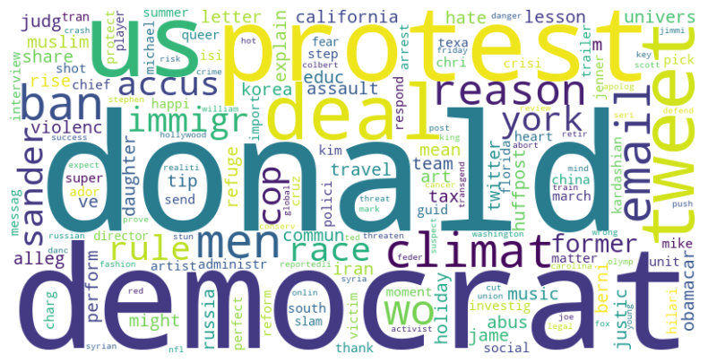

# sarcastic-speech-detection

This project focuses on using **Natural Language Processing (NLP)** techniques to predict whether a headline from a news website contains sarcasm. The task involves building a predictive model using two distinct approaches for data modeling.

---

## Members

* Lucas Corlete Alves de Melo - **13676461**
* Marcus Vinicius da Silva - **13833150**
* Vítor Augusto Paiva de Brito - **13732303**

---

## Installing requirements

In order to be able to run the *Jupyter* notebooks to enhance the code **reproducibility**, it is necessary to install the requirements.

```bash
pip install -r requirements.txt
```

## Data Modeling Approaches

1. **Word Frequency and Word Count Analysis**
   - Utilize the difference in word frequency between the target classes.
   - Incorporate the word count of each headline as a feature for prediction.

2. **Neural Network with Word Embeddings**
   - Employ a word embedding method with `Keras` to extract patterns in the data.
   - Leverage neural network architectures to capture semantic relationships between words.

---

## Objectives

- Develop models capable of accurately identifying sarcasm in headlines.
- Compare and evaluate the performance of traditional feature engineering techniques against deep learning methods.



---

## Conclusion

This project highlights the versatility of NLP techniques by contrasting traditional and deep learning-based approaches for sarcasm detection. The insights gained from this work can be applied to broader sentiment analysis and language understanding tasks.

---

### References

https://thecleverprogrammer.com/2021/08/24/sarcasm-detection-with-machine-learning/