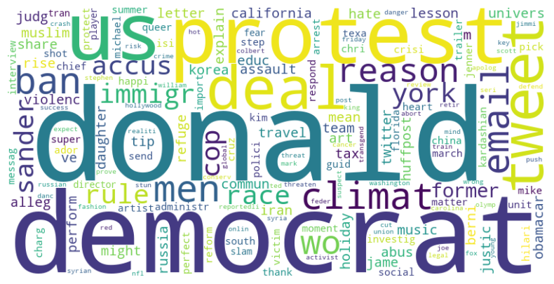

## Sarcasm Detection in Headlines

### **Objective**
To develop a binary classification model capable of predicting whether a headline is sarcastic or not, improving sentiment analysis models' ability to interpret nuanced language.

## Data analysis

### **1. Data Preprocessing**
The preprocessing step converted headlines to lowercase for standardization. As shown in the table, each headline is categorized as **sarcastic (1)** or **non-sarcastic (0)**. Additionally, the website hostname associated with each headline was extracted to assess its relevance as a predictive variable.

However, the analysis of sarcasm proportions by hostname revealed that certain websites are strongly correlated with a single class. This indicates that the `hostname` variable should not be used as a predictive attribute to avoid deterministic bias.

---

### **2. Null Values Check**
The dataset contains no null values, as confirmed by the analysis. Therefore, no additional handling is required.

---

### **3. Class Balance**
The dataset is imbalanced, with 56% of the data representing non-sarcastic headlines and 44% sarcastic ones. This imbalance suggests that techniques such as resampling (oversampling or undersampling) may be necessary to avoid bias during model training.

---

### **4. Token Analysis**
Tokenizing the headlines revealed that sarcastic headlines have greater variation in token length, indicating a wider range in word count. This difference can be explored for predictive purposes.

---

### **5. Unique Tokens Analysis**
The proportion of unique words in each headline was analyzed. While the total token count varies between sarcastic and non-sarcastic headlines, the proportion of repeated words is similar across classes. This suggests that word repetition is not a strong indicator of sarcasm.

---

### **6. Word Frequencies and Topics**
The most frequent words for each class were identified, including those exclusive to sarcastic and non-sarcastic headlines. Words in non-sarcastic headlines generally relate to political and global topics, while sarcastic headline words are more specific and humorous.

---

### **7. Word Clouds**
Word clouds were used to visualize the most common words in each class. Common words across both classes are less significant for predictions, while unique words offer greater predictive potential.

---

### **8. Grammatical Class Distribution**
The distribution of word grammatical classes in the headlines was compared across target classes. While the overall distribution is similar, minor differences in less frequent classes suggest that certain types of words might be more relevant for sarcasm detection.

---

### **9. Word Embedding and Dimensionality Reduction**
Using Word2Vec and PCA, the similarities of the most common words were visualized in a two-dimensional space. The results show no clear separation between classes, indicating that this task requires more complex models to capture patterns and nuances in the data.

---

### **Insights and Next Steps**
- The analysis revealed that token distributions and unique word patterns have statistical relevance for sarcasm detection.
- The absence of explicit separation in word embeddings suggests the need for more sophisticated models, such as deep neural networks or attention-based methods, to improve prediction accuracy.

## **Data Modeling**

### **Objective**
To build models capable of predicting sarcasm in headlines using two approaches:
1. **Frequency-based features**: Leveraging word frequency differences between target classes.
2. **Neural Network embedding**: Utilizing `keras` to process data and extract patterns.

---

### **Feature Engineering**
1. **Sampling**: A 3% stratified sample was created from the training set to reduce computational costs during hyperparameter tuning while preserving class proportions.
2. **Frequency Difference Calculation**:
   - Words frequent in non-sarcastic headlines were assigned positive values, while those frequent in sarcastic headlines received negative values.
   - The difference was multiplied by the word count in each row to enhance discrimination.

---

### **Standardization**
StandardScaler was applied to standardize features, mitigating scale differences across variables.

---

### **Model Training**
1. **Naive Bayes**:
   - Trained with a Bernoulli distribution and hyperparameter tuning via GridSearchCV.
   - Results:
     - Accuracy: ~84% on test data.
     - Overfitting observed, with training accuracy significantly higher than test accuracy.

2. **Principal Component Analysis (PCA)**:
   - Reduced feature dimensionality to 2000 components (10% of training data rows).
   - PCA reduced overfitting but slightly lowered accuracy to ~80%.

3. **Random Forest**:
   - Initial training showed overfitting, addressed by limiting depth and minimum samples per leaf.
   - Results:
     - Accuracy: ~80% on test data.
     - Overfitting reduced, but irreducible error remained a limiting factor.

   

   - Key observation: Common words like 'the', 'and', and 'is' showed high discriminative value for sarcasm.

4. **Neural Network Embedding**:
   - Implemented using `keras` with a convolutional neural network and embedding layers.
   - Results:
     - Accuracy: ~81% on test data.
     - Showed overfitting across embedding dimensions (5-50).
     - Accuracy consistency indicated potential inefficiency in network topology.

   

---

### **Statistical Evaluation**
1. **Bootstrap Resampling**:
   - Confidence intervals (95%) for model accuracy:
     - Naive Bayes: [0.8349, 0.8507]
     - Random Forest: [0.7955, 0.8124]
     - Neural Network: [0.8012, 0.8165]

   
   
   

2. **Friedman and Nemenyi Tests**:
   - Evaluated model differences using cross-validation scores.
   - Naive Bayes showed the most distinct performance compared to Random Forest and Neural Network models.

   

---

### **Conclusion**
1. **Best Model**:
   - Naive Bayes (Bernoulli distribution) emerged as the most efficient model with:
     - ~85% accuracy on test data.
     - Weighted f1 score: ~85%.
   - Statistically distinct performance from Random Forest and Neural Network models.

2. **Feasibility**:
   - Extracting discriminant features for sarcasm detection is highly feasible using both:
     - **Frequency-based methods**: Effective for heuristic approaches.
     - **Neural Network embeddings**: Useful despite higher computational cost.

3. **Key Insight**:
   - Sarcasm detection in human-readable text is achievable with consistent accuracy and balanced class predictions.